# VPN Brute Force Detection and Investigation Using Splunk

**Project Objective:**  
Simulate a real SOC investigation using Splunk to detect, investigate, and validate a VPN brute force authentication attack. Focus is on authentication abuse and account compromise.

**Data Source:**  
VPN authentication logs from TryHackMe.

**Tool Used:**  
Splunk (local installation)

---

## 1. Log Ingestion and Validation

The VPN logs were ingested into Splunk by uploading the JSON file. We confirmed that the logs were visible, fields were parsed correctly, and the source type was correctly detected as JSON.

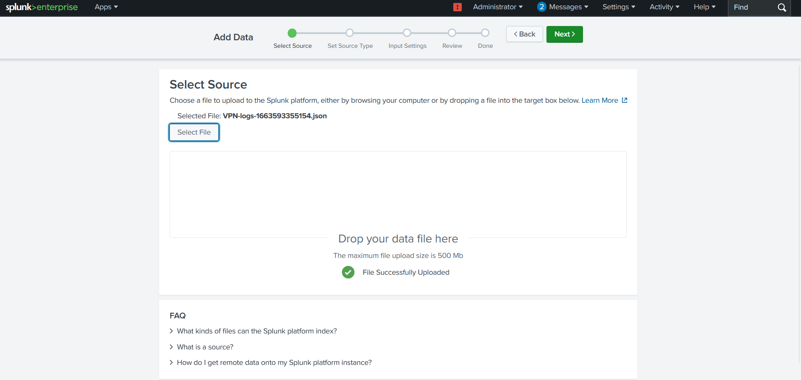

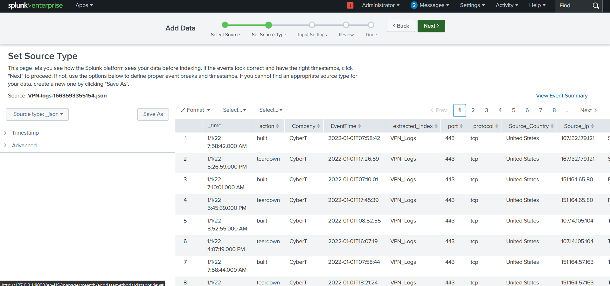

---

## 2. Initial Log Review

A quick review of the logs was done to understand the data, the fields available, and the structure.

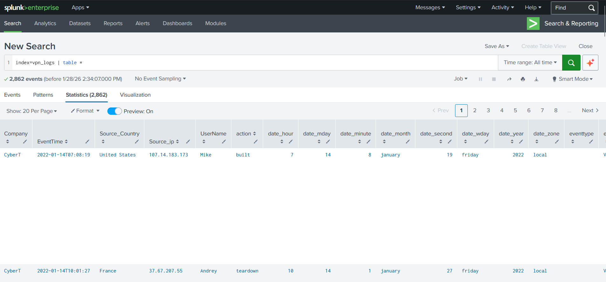

---

## 3. Action Analysis

We analyzed the counts of different actions in the logs.  
- **Built:** 1,297 (successful connections)  
- **Failed:** 274 (failed authentication attempts)  
- **Teardown:** 1,291 (sessions dropped)  

Focus was placed on the **failed authentication events**.

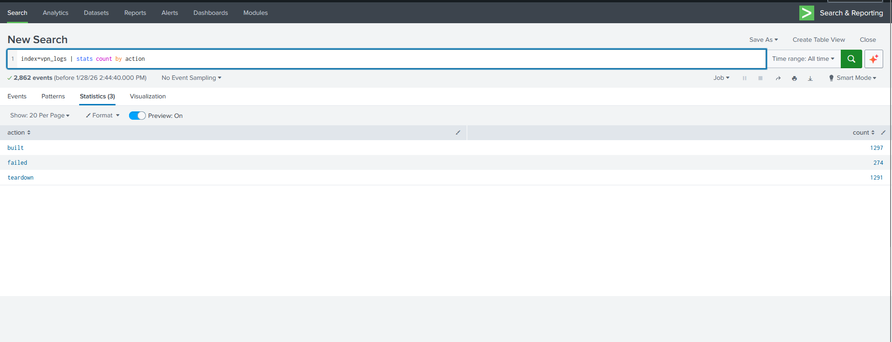

---

## 4. Username Activity Analysis

Stats counts by username revealed that the user **Simon** had the highest number of events (278), indicating suspicious activity.

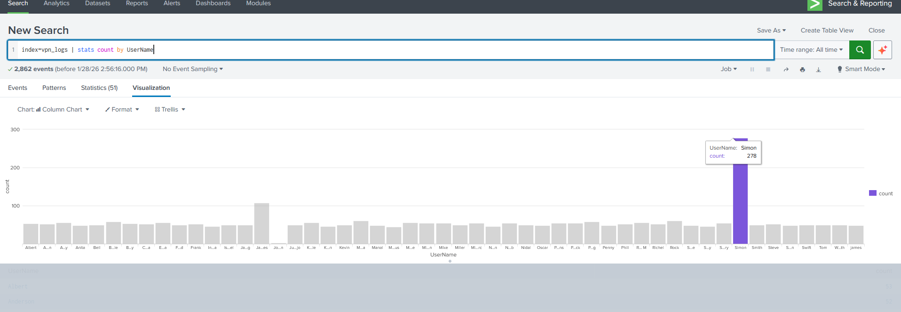

---

## 5. Source IP Analysis

Stats counts by source IP showed that **172.201.60.191** was responsible for the same 278 events, matching the username Simon.

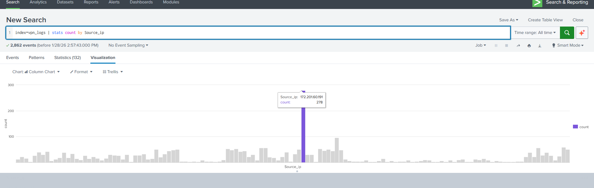

---

## 6. Time-Based Activity Analysis

Time-based charts revealed **rapid spikes of failed authentication**, with a particularly high number of events on **Tuesday, January 11th**.

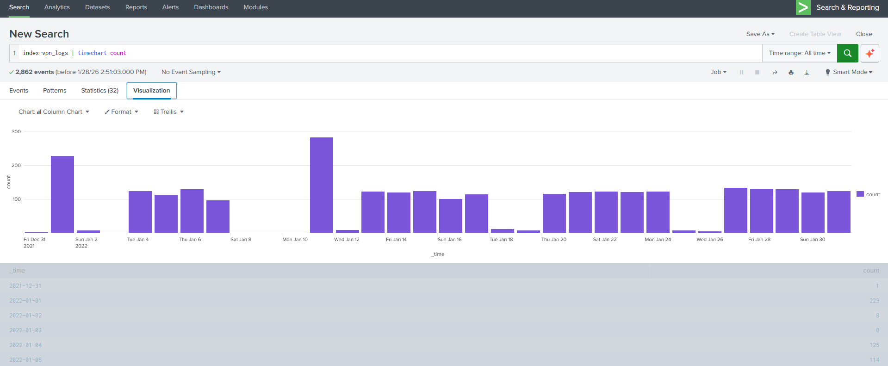

---

## 7. Combined Username, Source IP, and Action Analysis

We combined **username, source IP, and action fields** to identify patterns. Simon’s account had **274 failed attempts** from the same IP, followed by **4 successful authentications**.

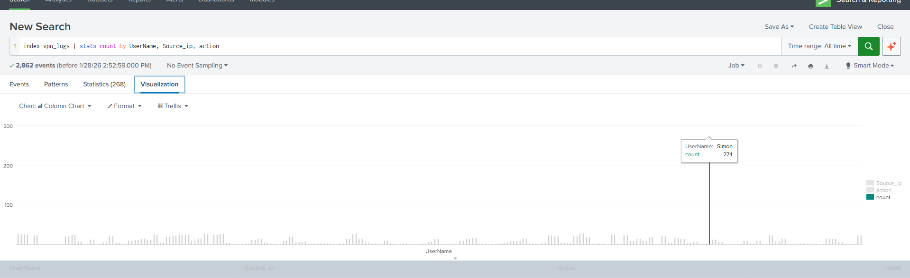

---

## 8. Failed Authentication Burst Analysis

We checked failed authentication bursts using 5-minute time spans:  
- 7:25 → 144 events  
- 7:30 → 129 events  
- 7:35 → 1 event  

This confirmed rapid attempts within short intervals.

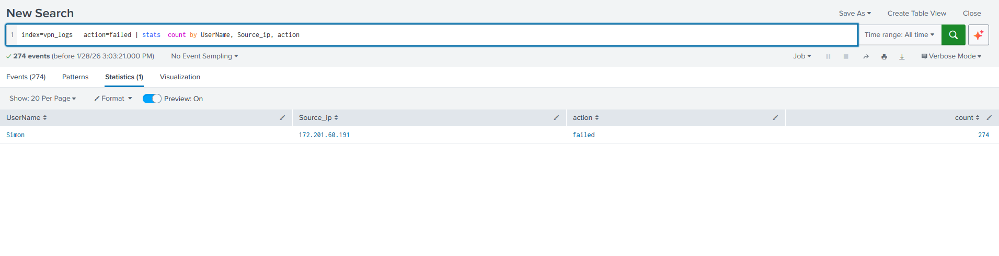
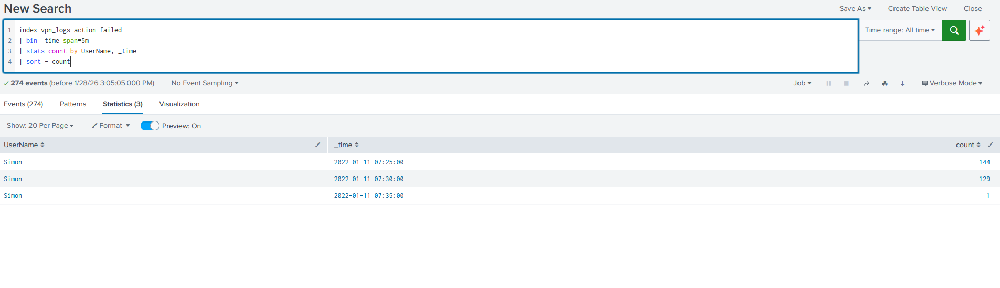

---

## 9. Source Context Review

Details of the source IP were checked:  
- **Country:** Canada  
- **State:** Alberta  
- **Port:** 443  
- **Protocol:** TCP  

This helped understand the attack origin.

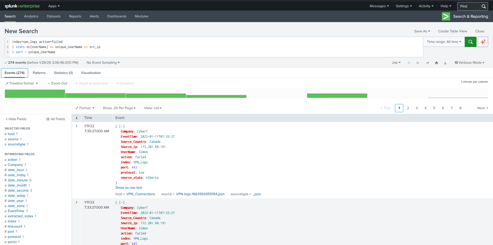

---

## 10. Successful Authentication Review

Simon’s successful login events (built) were reviewed to understand the impact and duration of the session.

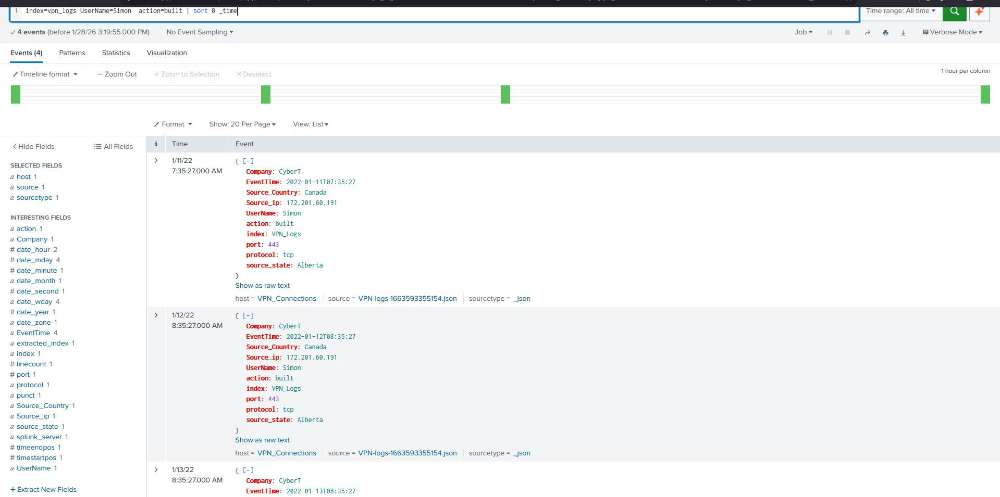

---

## 11. First and Last Activity Analysis

We determined the timeline for Simon’s activity:  
- **First event:** 11th January, 7:28  
- **Last event:** 15th January, 8:35  
- **Duration:** 3,496 units (log metric)  

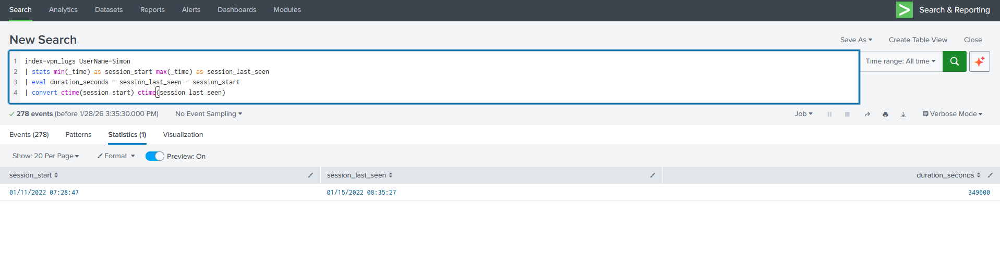

---
# VPN Authentication Security Incident Report

**Incident Name:** VPN Brute Force Authentication Attempt  
**Incident Type:** Authentication Abuse / Account Compromise  
**Affected Account(s):** Simon  
**Affected System:** VPN Server (Logs sourced from TryHackMe lab)  
**Detection Tool:** Splunk  
**Detection Method:** Log analysis of VPN authentication attempts  

---

## Summary
A brute force authentication attempt was detected on the VPN server. The user `Simon` generated **274 failed login attempts** over multiple days before successfully authenticating. The source IP for all failed attempts was `172.201.60.199`, originating from Alberta, Canada. 

Rapid spikes of failed authentication attempts were observed within short time intervals, indicating potential account compromise or testing of credentials. 

**Key Observations:**
- **Failed → Success Pattern:** After repeated failed attempts, Simon successfully logged in four times.  
- **Timeframe:** First failed attempt on 11th January 2022, last successful login on 15th January 2022.  
- **Rapid Attempt Bursts:** Notable spikes observed at 7:25 – 7:30 (144 and 129 failed attempts).  

---

## Next Steps / Recommendations
- Enforce multi-factor authentication (MFA) on all VPN accounts.  
- Investigate whether the source IP is legitimate or malicious.  
- Monitor for repeated login patterns from the same IP or user.  
- Review account lockout policies and implement stricter thresholds.  
- Full investigation details, including screenshots and queries, can be found in the attached [PDF documentation](./VPN_Authentication_Investigation.pdf).

---

> Note: This is a summarized incident report. Full investigation and analysis details are documented in the attached PDF.

## Conclusion

This project successfully simulated a SOC investigation workflow:  
- VPN logs were ingested and validated  
- Failed authentication events were detected and analyzed  
- The suspicious account and source IP were identified  
- Patterns of brute force attempts were validated  
- Successful authentications were reviewed to confirm compromise potential  

This demonstrates how a SOC analyst would investigate authentication abuse using Splunk.

